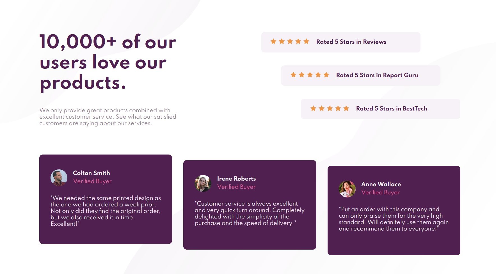

# Frontend Mentor - Stats preview card component solution

This is a solution to the [Stats preview card component challenge on Frontend Mentor](https://www.frontendmentor.io/challenges/stats-preview-card-component-8JqbgoU62). Frontend Mentor challenges help you improve your coding skills by building realistic projects. 

## Table of contents

- [Overview](#overview)
  - [The challenge](#the-challenge)
  - [Screenshot](#screenshot)
  - [Links](#links)
- [My process](#my-process)
  - [Built with](#built-with)
  - [What I learned](#what-i-learned)
  - [Continued development](#continued-development)
- [Author](#author)

## Overview

### The challenge

## The challenge

Your challenge is to build out this social proof section and get it looking as close to the design as possible.

You can use any tools you like to help you complete the challenge. So if you've got something you'd like to practice, feel free to give it a go.

Your users should be able to:

- View the optimal layout for the section depending on their device's screen size

### Screenshot

### Links

[Live Preview](https://nabil-y.github.io/ProjectHub/Challenge5/Chal5.html)

## My process

### Built with

- Semantic HTML5 markup
- CSS custom properties
- Flexbox
- Responsive Grid 
- Responsive Design with media queries

### What I learned

- More experience with responsive grids 
- More experience with flexbox and responsive design in general
- Better understanding of semantic html tags and when to use them
- Use multiple backgrounds for the same element 

### Continued development

Grid seems very powerful but is also very complex, I need to study it more

Had some trouble figuring out how multiply the star for ratings. Repeating background was weird and didn't work as intended, apparently I can do it with JS but I don't know any JS (for now). In the end, I decided to use five img tags. Not the best but it works and it allows to easily space the stars which I couldn't do with background repeat. I'll have to figure it out later.

## Author

- Frontend Mentor - [@Nabil-Y](https://www.frontendmentor.io/profile/Nabil-Y)

